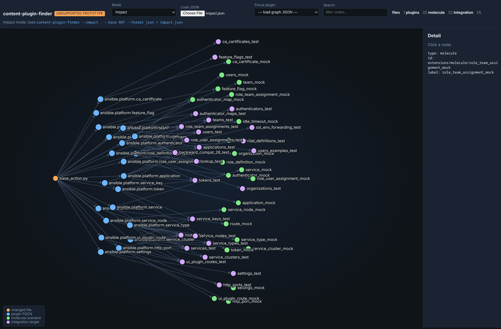

# content-plugin-finder

> **Unsupported prototype.** This repository is an early experiment under
> active development. APIs, CLI flags, and behavior may change without notice.
> There is no support commitment, stability guarantee, or production readiness
> claim. Use at your own risk.

Find Ansible **modules**, **filters**, and **lookups** used in directories such as Molecule scenarios or ansible-test integration targets, and map git changes to molecule scenarios / ansible-test integration targets that should run.

Uses a pluggable [**crawler subsystem**](#crawler-subsystem).



## Vendored [ansible-content-capture](https://github.com/ansible/ansible-content-capture)

This project vendors [ansible-content-capture](https://github.com/ansible/ansible-content-capture) (Apache-2.0) under `src/ansible_content_capture/`. See [LICENSE.ansible-content-capture](LICENSE.ansible-content-capture) and [NOTICE](NOTICE).

The following modifications have been made to [ansible-content-capture](https://github.com/ansible/ansible-content-capture):

- `loader.get_scanner_version()` was patched to use `importlib.metadata` instead of removed `pkg_resources` (setuptools ≥83).
- `finder._get_body_data()` caches YAML file reads with `lru_cache` (keyed on path, mtime, and size) to avoid re-parsing the same file on repeated format checks.
- `model_loader.load_taskfile()` splits YAML lines once and passes the pre-split list to each `load_task()` call instead of re-splitting per task.
- `model_loader.load_collection()` propagates `skip_task_format_error` through to `load_taskfile()` so strict-error settings are honoured during collection loading.
- `parser.Parser` accepts a pre-loaded `ScanData` object to skip a redundant preliminary scan when the caller already holds one.

## Installation

```bash
# PyPI
uv pip install content-plugin-finder
# Development
pip install -e ".[dev]"
```

## Visualizer

A zero-build dual-mode graph UI lives in [`viz/`](viz/) (d3 v7 from CDN).

### 1. Export JSON

From a collection checkout:

```bash
# Plugin dependency DAG (full graph, or focus one FQCN)
content-plugin-finder --collection-graph . --format json > graph.json
content-plugin-finder --collection-graph . --plugin ansible.platform.application --format json > plugin.json

# Impact flow (needs a git base, or pipe paths)
content-plugin-finder --impact . --base origin/main --format json > impact.json
echo 'plugins/action/base_action.py' \
  | content-plugin-finder --impact . --from-stdin --format json > impact.json
```

### 2. Open the UI

```bash
# optional: from the repo root
xdg-open viz/index.html   # or open viz/index.html in your browser
```

1. Open [`viz/index.html`](viz/index.html) (double-click or `file://` is fine).
2. Click **Choose File** / **Load JSON** and select `graph.json` or `impact.json`.
3. Mode is auto-detected from the JSON shape; you can override with the **Mode** control.
4. **Plugin dependencies**: pick a **Focus plugin** FQCN (recommended). Click a node for path + owning plugins.
5. **Impact**: explore changed files → plugins → molecule / integration roots. Counts appear in the toolbar.

| Mode                | JSON source                                                  | View                                                                 |
| ------------------- | ------------------------------------------------------------ | -------------------------------------------------------------------- |
| Plugin dependencies | `--collection-graph --format json` (full or `--plugin FQCN`) | Focus one FQCN (recommended) or capped “All”; nodes are Python files |
| Impact              | `--impact --format json`                                     | Changed files → plugin FQCNs → molecule / integration roots          |

No npm build. The file picker works with `file://` (browsers block `fetch` of local paths).

## Usage

```bash
content-plugin-finder path/to/scenario [path/to/target ...]
content-plugin-finder --format json --by-directory path/to/scenario
content-plugin-finder --types module,filter path/to/scenario
content-plugin-finder --list-crawlers

# Discover Molecule scenarios + integration targets under a collection/repo
content-plugin-finder --parent ../ansible.platform --depth 4 --list-roots
content-plugin-finder --parent ../ansible.platform --depth 4
content-plugin-finder --parent ../ansible.platform --workers 8
```

`--parent` walks for:

- directories containing `molecule.yml`
- `tests/integration/targets/<name>/`

`--depth` is the max relative depth under `--parent` (default `4`).
For a collection root, depth `3` reaches `extensions/molecule/<scenario>`;
depth `4` also reaches `tests/integration/targets/<target>`.

CLI directory scans use up to four processes by default. Use `--workers N` to tune
the parallelism for the available CPU and memory, or `--workers 1` for serial
execution. Library calls through `Orchestrator.scan()` remain serial unless
`workers` is explicitly set.

## Crawler subsystem

| Crawler  | Kind   | Source                                                |
| -------- | ------ | ----------------------------------------------------- |
| `module` | module | ansible-content-capture task/module trees             |
| `filter` | filter | Jinja pipes in YAML scalars                           |
| `lookup` | lookup | ACC lookup/query tasks + Jinja `lookup()` / `query()` |

Modules and action plugins are reported together as modules (not distinguishable from content alone).

## Collection import graph

Build a Python import tree and plugin **name map** for a collection:

```bash
content-plugin-finder --collection-graph ../ansible.platform
content-plugin-finder --collection-graph ../ansible.platform --plugin application
content-plugin-finder --collection-graph ../ansible.platform --plugin ansible.platform.application --format json
```

Output is **per plugin** (FQCN): entry files (module + action when both exist) plus the
**transitive** in-collection dependency closure (`depends_on_files`). Direct
file→import edges remain available in the JSON under `plugins` / `imports`.

Plugin identity is always the **FQCN** `{namespace}.{name}.{plugin}` from `galaxy.yml`
plus the short plugin name (e.g. `ansible.platform.application`).
`--plugin application` is accepted as a short alias and resolved to that FQCN.

| Kind   | Short name source (then prefixed with collection FQCN)                           |
| ------ | -------------------------------------------------------------------------------- |
| module | `DOCUMENTATION` `module:` / file stem                                            |
| action | `ActionModule.MODULE_NAME`, else matching `plugins/modules/<stem>.py`, else stem |
| filter | keys from `FilterModule.filters()` (one file may expose many filters)            |
| lookup | `DOCUMENTATION` `name:` / file stem                                              |

## Impact (git changes → tests to run)

```bash
# Local / CI with explicit base (PR target SHA or branch)
content-plugin-finder --impact . --parent . --base origin/main
content-plugin-finder --impact . --base "$PR_BASE_SHA" --head "$PR_HEAD_SHA"

# Pipe changed paths (CI escape hatch)
git diff --name-only "$BASE" "$HEAD" | content-plugin-finder --impact . --from-stdin

# Emit only names for a matrix
content-plugin-finder --impact . --base origin/main --emit molecule --names-only
content-plugin-finder --impact . --base origin/main --emit integration --names-only
content-plugin-finder --impact . --base origin/main --format json
```

Text output (default):

```text
molecule	extensions/molecule/application_mock
integration	tests/integration/targets/applications_test
```

In JSON mode, the impact report includes stable affected-content fields:

```json
{
  "collection": "acme.widgets",
  "changed_files": ["roles/agent/tasks/main.yml"],
  "affected_plugins": [],
  "affected_roles": ["acme.widgets.agent"],
  "molecule_scenarios": ["extensions/molecule/thing_mock"],
  "integration_targets": ["tests/integration/targets/thing_test"],
  "reasons": {
    "extensions/molecule/thing_mock": [
      "role:acme.widgets.agent via roles/agent/tasks/main.yml"
    ],
    "tests/integration/targets/thing_test": [
      "role:acme.widgets.agent via roles/agent/tasks/main.yml"
    ]
  }
}
```

`affected_plugins` and `affected_roles` are always present. Each uses an empty
list when its content type is unaffected.

In CI, pass the PR **base SHA** (or fetch the target branch). Bare `git diff` without a base is not reliable on shallow/detached checkouts. Three-dot `base...head` is the default; use `--two-dot` for `base head`.

```text
git changed files
        │
        ├─ under scenario/target     → that root
        │     (path layout works even if discovery depth missed the root)
        ├─ shared molecule file      → all discovered molecule scenarios
        │     (e.g. extensions/molecule/requirements.yml)
        ├─ roles/<role>/...          → local role FQCN
        │       │
        │       └─ role index → molecule scenarios / integration targets
        └─ collection .py            → file_to_plugins → plugin FQCNs
                │
                └─ content index → molecule scenarios / integration targets
```

A changed path below `roles/<role_name>/` affects the local role
`<namespace>.<collection>.<role_name>`, using the collection identity from
`galaxy.yml`. Every discovered Molecule scenario or ansible-test integration
target that references that role is selected. The match is conservative: any
file owned by the role selects every root that uses the role.

Role indexing supports string and mapping entries under play-level `roles:`,
plus short and `ansible.builtin` forms of `include_role` and `import_role`.
Short role names resolve against the local collection. Literal
`import_playbook`, `import_tasks`, and `include_tasks` paths are followed while
they remain below `--parent`; dynamic Jinja import paths are not evaluated.

Direct path matches cover scenario and integration-target edits themselves, not only
plugin→content reverse mapping. Shared files under a `molecule/` directory (outside
any scenario) select every discovered molecule scenario. Deleted paths are included
in the git diff (`ACMRD`).

### Running Molecule or ansible-test from the list

Emit leaf names, then drive the tools your collection already uses:

```bash
content-plugin-finder --impact . --base origin/main \
  --emit molecule --names-only > molecule.txt
content-plugin-finder --impact . --base origin/main \
  --emit integration --names-only > integration.txt
```

**Molecule** (scenario name = directory under `extensions/molecule/` or `molecule/`):

Serial (one scenario at a time):

```bash
while read -r scenario; do
  [ -n "$scenario" ] || continue
  molecule test -s "$scenario"
done < molecule.txt
```

With Molecule **workers** (experimental concurrent scenarios; multiple `-s` + `--workers`):

```bash
args=()
while read -r scenario; do
  [ -n "$scenario" ] || continue
  args+=(-s "$scenario")
done < molecule.txt

((${#args[@]})) || exit 0
molecule test "${args[@]}" --workers cpus-1
# optional: --continue-on-error
```

`--workers` accepts an integer, `cpus`, or `cpus-1`. Prefer this over a serial loop when the collection supports shared-state / ansible-native multi-scenario runs. See Molecule’s docs for `--workers` / `--shared-state` behavior (default scenario create/destroy stays on the main process).

**ansible-test integration** (target name = directory under `tests/integration/targets/`):

```bash
mapfile -t targets < integration.txt
if ((${#targets[@]})); then
  ansible-test integration --docker default "${targets[@]}"
fi
```

Adjust Molecule/ansible-test flags to match your collection CI. An empty file means nothing to run for that kind.

Minimal PR CI sketch (fetch full history or the base SHA first):

```yaml
- uses: actions/checkout@v4
  with:
    fetch-depth: 0

- name: Select tests
  run: |
    content-plugin-finder --impact . \
      --base "${{ github.event.pull_request.base.sha }}" \
      --head "${{ github.sha }}" \
      --emit molecule --names-only | tee molecule.txt
    content-plugin-finder --impact . \
      --base "${{ github.event.pull_request.base.sha }}" \
      --head "${{ github.sha }}" \
      --emit integration --names-only | tee integration.txt

- name: Molecule
  run: |
    args=()
    while read -r s; do
      [ -n "$s" ] || continue
      args+=(-s "$s")
    done < molecule.txt
    ((${#args[@]})) || exit 0
    molecule test "${args[@]}" --workers cpus-1

- name: ansible-test
  run: |
    mapfile -t t < integration.txt
    ((${#t[@]})) || exit 0
    ansible-test integration --docker default "${t[@]}"
```

## Library

```python
from pathlib import Path
from content_plugin_finder.crawl.orchestrator import Orchestrator
from content_plugin_finder.collection import build_collection_graph
from content_plugin_finder.impact import compute_impact

report = Orchestrator().scan([Path("extensions/molecule/default")])
print(report.to_dict())

graph = build_collection_graph(Path("../ansible.platform"))
print(graph.resolve("application").name)  # ansible.platform.application

impact = compute_impact(
    collection_root=Path("../ansible.platform"),
    changed_files=["plugins/action/base_action.py"],
)
print(impact.molecule_scenarios)
print(impact.integration_targets)
print(impact.affected_plugins)
print(impact.affected_roles)
```

## LICENSE

**MIT** (see [LICENSE](LICENSE)).
